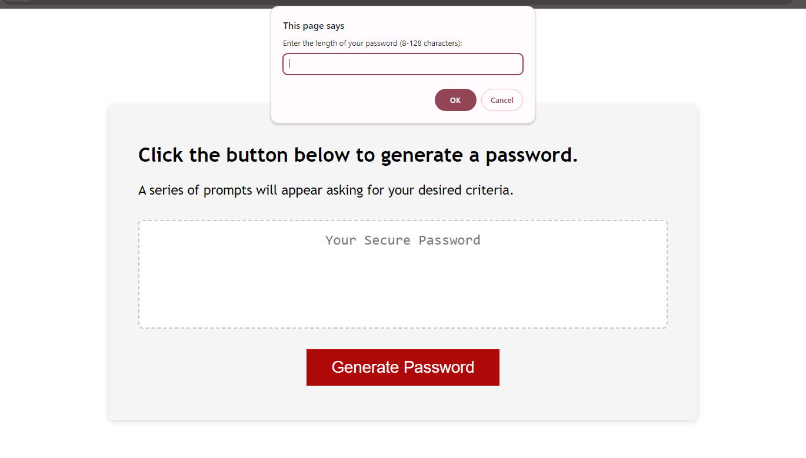

# Password Generator

## Description

This project uses JavaScript to create a password generator based on browser prompt inputs.

### Features:
* Generates a password when the button is clicked
  * Presents a series of prompts for password criteria:
    * Length of password (at least 8 characters but no more than 128)
    * Character types:
      * Lowercase
      * Uppercase
      * Numeric
      * Special characters ($@%&*, etc)
  * Once prompts are answered then the password is generated and displayed on the page

### Linkss

* [Deployed website](https://aoifeedx.github.io/password-generator/)
* [GitHub repository](https://github.com/AoifeEdX/password-generator)

## Credits

Instructions and starter code provided by edX (Skills Boot Camp in Front-End Web Development). 

### Resources

The following sites were used for reference:

* Guide on the basics of JavaScript from [Learn X in Y minutes](https://learnxinyminutes.com/docs/javascript/).
* Guide on 'Math' methods from [MDN Web Docs](https://developer.mozilla.org/en-US/docs/Web/JavaScript/Reference/Global_Objects/Math).
* Guide on showing JavaScript data in HTML from [JavaScript Tutorial](https://www.javascripttutorial.net/javascript-dom/javascript-textcontent/).

## License

MIT License

Copyright (c) 2023 AoifeEdX

Permission is hereby granted, free of charge, to any person obtaining a copy of this software and associated documentation files (the "Software"), to deal in the Software without restriction, including without limitation the rights to use, copy, modify, merge, publish, distribute, sublicense, and/or sell copies of the Software, and to permit persons to whom the Software is furnished to do so, subject to the following conditions:

The above copyright notice and this permission notice shall be included in all copies or substantial portions of the Software.

THE SOFTWARE IS PROVIDED "AS IS", WITHOUT WARRANTY OF ANY KIND, EXPRESS OR IMPLIED, INCLUDING BUT NOT LIMITED TO THE WARRANTIES OF MERCHANTABILITY, FITNESS FOR A PARTICULAR PURPOSE AND NONINFRINGEMENT. IN NO EVENT SHALL THE AUTHORS OR COPYRIGHT HOLDERS BE LIABLE FOR ANY CLAIM, DAMAGES OR OTHER LIABILITY, WHETHER IN AN ACTION OF CONTRACT, TORT OR OTHERWISE, ARISING FROM, OUT OF OR IN CONNECTION WITH THE SOFTWARE OR THE USE OR OTHER DEALINGS IN THE
SOFTWARE.
